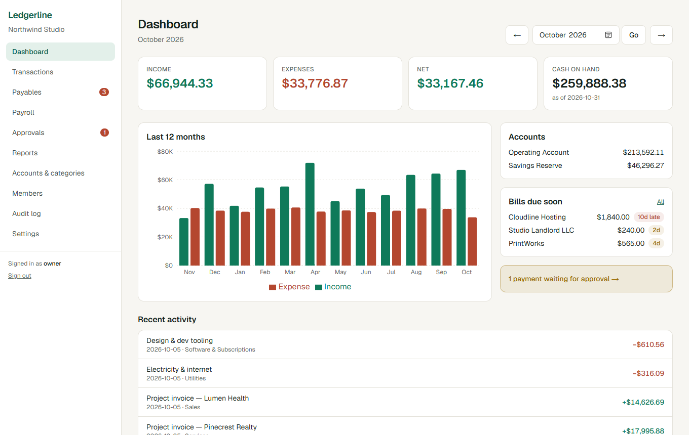
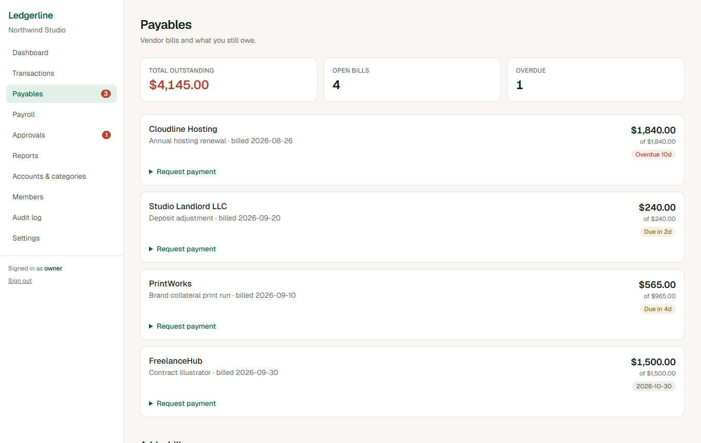
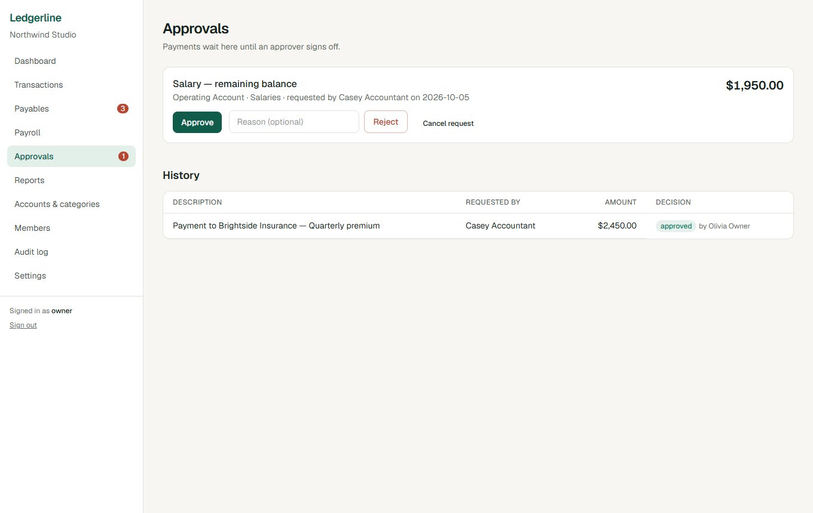
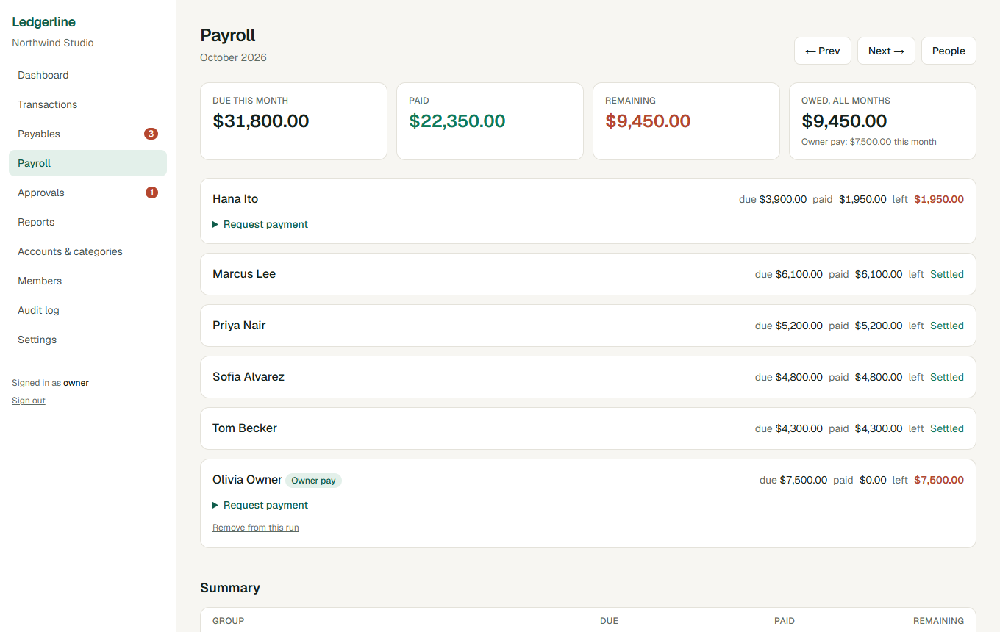
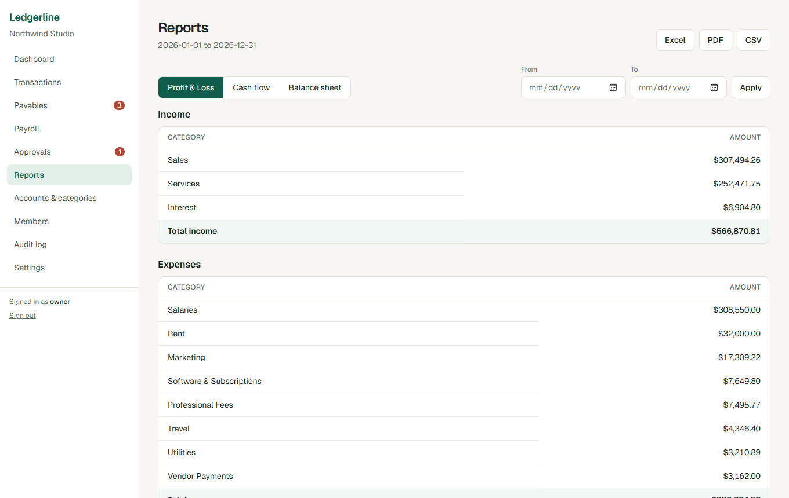
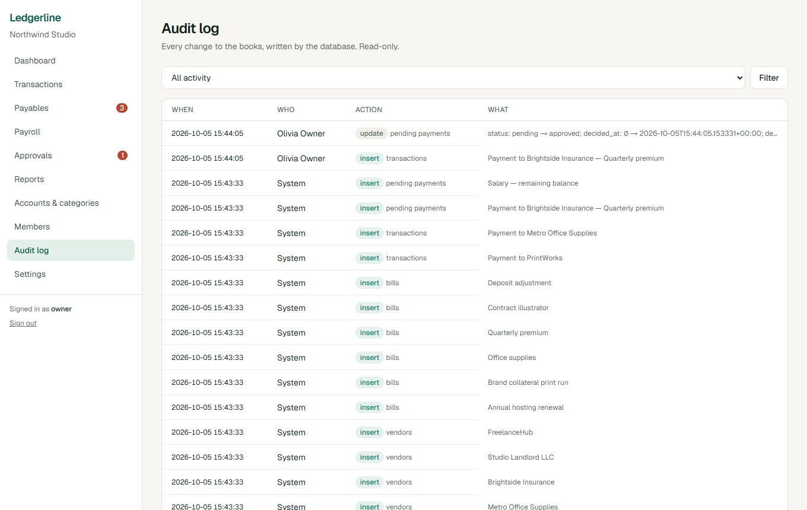
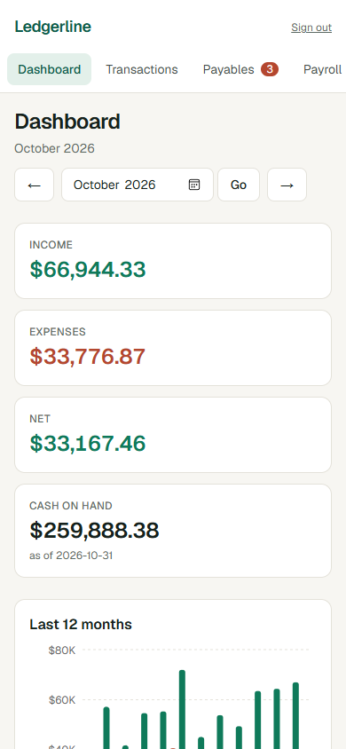

# Ledgerline

**Multi-tenant accounting for small and growing companies**: bank accounts, transactions, payables, payroll, payment approvals, and audit-ready reports. Tenant isolation is enforced **in Postgres**, not in application code, and it's proven by automated tests.



> **Why this exists.** Ledgerline is a ground-up, general-purpose rebuild of an internal accounting tool I built and ran for a real company (Flask + SQLite, one hardcoded business, one currency, two roles). The interesting engineering is the *generalization*: turning a one-customer tool into a product any company can sign up for without leaking each other's data. See [What I generalized](#what-i-generalized-from-the-original).

## Highlights

| | |
|---|---|
| **Real multi-tenancy** | Every tenant table carries `org_id` and is protected by Row-Level Security. A bug or a forgotten `WHERE` in app code cannot expose another company's books. |
| **Cross-tenant guard** | Foreign keys alone would let org A's row point at org B's bank account. A trigger rejects cross-tenant references (tested). |
| **Approvals that can't be bypassed** | Payments are requested, then approved by *someone else* (four-eyes rule). Approval runs as one atomic Postgres function that re-checks role, status and self-approval. |
| **Money-safe** | `numeric(15,2)` in the database; exact integer minor-unit arithmetic in TypeScript. No floats. Overpaying a bill or salary is blocked by a row-locking trigger, so two concurrent payments can't both slip under the limit. |
| **Audit trail by the database** | Triggers write an append-only audit log (before/after) for every ledger change. Clients can't forge or delete entries. |
| **Roles & invitations** | `viewer < accountant < approver < admin < owner`, enforced by RLS and mirrored in the UI. Invite links are single-use, expire, are bound to the invited email, and only a hash is stored. |
| **Reports + exports** | P&L, cash flow, balance sheet → Excel (real numeric cells), PDF, CSV (with spreadsheet-formula-injection protection). |
| **Per-company currency & fiscal year** | Formatting via `Intl`, fiscal-year logic unit-tested including leap years. |

## Screenshots

| Payables | Approvals |
|---|---|
|  |  |

| Payroll | Reports |
|---|---|
|  |  |

| Audit log | Mobile |
|---|---|
|  |  |

## Architecture

```mermaid
flowchart LR
  B[Browser] -->|session cookie| N[Next.js App Router<br/>server components + server actions]
  N -->|user's JWT, never the service key| S[(Supabase Postgres)]
  S --- RLS{{Row-Level Security<br/>is_member&#40;org, role&#41;}}
  S --- FN[Postgres functions<br/>create_organization, approve_pending_payment,<br/>reports, overpayment + audit triggers]
  N -->|exceljs / react-pdf| X[Excel · PDF · CSV exports]
```



Design choices worth calling out:

- **The app runs as the user.** Server code uses the caller's JWT, so RLS applies to every query. The service-role key exists only in the seed script.
- **Authorization in layers.** `requireRole()` in server actions gives fast, friendly redirects; RLS is the actual boundary. UI hiding is a convenience, never the control.
- **Business rules live next to the data.** Approve/reject, org creation, overpayment checks and reports are Postgres functions/triggers, so every client (this app, a script, a future API) gets the same guarantees.
- **Reports are SQL functions** (`security invoker`, so RLS applies) returning aggregates; TypeScript only shapes and formats them. A single report model feeds the screen and all three exporters.
- **Defense in depth on inputs.** Zod validation in every action; `redirect` targets restricted to same-site paths; PostgREST filter characters stripped from search; CSV import re-validates on the server and is all-or-nothing.

## Testing

| Layer | What | Count |
|---|---|---|
| Database (pgTAP) | Tenant isolation across every table, role ladder, cross-tenant references, audit immutability, approvals, four-eyes, overpayment (insert/update/restore), soft-delete balances, transfers, payroll, invitations (wrong email, replay, expiry, forgery), reserved URL slugs | **77 assertions** |
| Unit (Vitest) | Money math, fiscal-year ranges, report builders, CSV parser/validator, CSV-injection guard, open-redirect guard, real Excel + PDF generation | **39 tests** |
| End-to-end (Playwright) | Sign up → onboard → record transaction → see it on dashboard → export; second tenant gets 404s; read-only viewer is bounced from write/admin routes; a brand-new person joins via an invite link, once | **3 flows** |

CI (`.github/workflows/ci.yml`) runs all of it, including a real local Supabase, on every push.

The database tests earned their keep during development: they caught a production bug in `create_organization` (an extension function not visible from a `SECURITY DEFINER` search path) before any user could hit it, and browser verification caught a query that listed teammates' memberships as the user's own.

## Run it locally

Prerequisites: Node 22+, Docker.

```bash
npm install
npx supabase start                 # local Postgres + Auth (first run pulls images)
npx supabase status -o env         # copy API_URL, ANON_KEY, SERVICE_ROLE_KEY into .env.local (see .env.example)
npm run seed:demo                  # creates "Northwind Studio" with 12 months of data
npm run dev                        # http://localhost:3000
```

Demo users (fictional, local only; password `ledgerline-demo`): `owner@`, `approver@`, `accountant@`, `demo@ledgerline.dev` (read-only viewer). Sign in and open `/northwind-studio/dashboard`.

```bash
npm test                 # unit tests
npm run test:db          # pgTAP: RLS + business rules
npm run e2e              # Playwright (uses installed Edge locally; Chromium in CI)
npm run seed:demo -- --reset   # rebuild the demo company
npm run screenshots      # regenerate README images
```

## What I generalized from the original

| Original (single company) | Ledgerline |
|---|---|
| One company, one SQLite file | Many organizations, isolated by RLS |
| Currency hardcoded | Per-company currency and fiscal-year start |
| Fixed "platforms" | Configurable business units |
| Directors vs. staff hardcoded | People with an owner-pay flag, reported separately |
| Hardcoded bank-account rules | Plain accounts and categories, managed per company |
| `admin` / `viewer` | Five roles, per company |
| App-level checks | Database-enforced isolation, overpayment guard, audit trail |
| Pending payments approved by an admin | Four-eyes approval as an atomic DB function |

## Trade-offs and what I'd do next

Honest limits of this first version:

- **Single-entry bookkeeping.** This is a cash-and-payables tracker, not a double-entry general ledger. A real accounting product would model journal entries and a chart of accounts; the balance sheet here is deliberately simplified (cash, payables, salaries payable, derived equity).
- **Invites are links, not emails.** Admins get a single-use, 7-day, email-bound link (only its hash is stored). Delivering it by email needs an SMTP/Resend integration, which I left out.
- **No bank feeds or invoicing.** CSV import covers migration; Plaid-style feeds and customer invoicing are the obvious next integrations.
- **Rate limiting and CSP.** Basic security headers are set; per-IP rate limiting and a strict Content-Security-Policy are next, alongside Supabase's auth rate limits.
- **Generated DB types.** Queries use light hand-written row types; `supabase gen types` would remove them.
- **Not yet deployed.** It runs against local Supabase; a hosted demo needs a Supabase project and a Vercel deploy.

If I were deploying this for a customer, the first week would be: import their history from their current tool, map their chart of accounts, set up approval thresholds, and wire audit-log exports into their compliance process.

## Stack

Next.js 16 (App Router, Server Actions) · TypeScript · Tailwind CSS 4 · Supabase (Postgres 17, Auth, RLS) · Zod · Recharts · exceljs · @react-pdf/renderer · Vitest · pgTAP · Playwright

---

Built by [Shamiur Rahman](https://github.com/Shamiur777).
